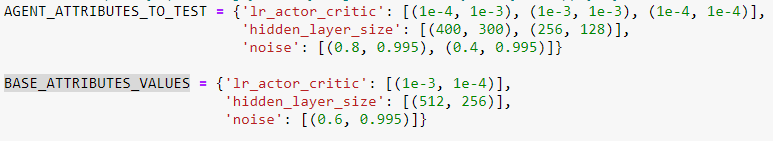

# p2-continous-control
Deep Reinforcement Learning - Project dedicated to train a double-jointed arm to move to target locations.

This project is part of the **Deep Reinforcement learning NanoDegree - Udacity**. It's the second project names p2-continuous-control

# The Environment

(source: Udacity Deep Reinforcement Learning NanoDegree)

In this environment, a double-jointed arm can move to target locations. A reward of +0.1 is provided for each step that the agent's hand is in the goal location. Thus, the goal of your agent is to maintain its position at the target location for as many time steps as possible.

The observation space consists of 33 variables corresponding to position, rotation, velocity, and angular velocities of the arm. Each action is a vector with four numbers, corresponding to torque applicable to two joints. Every entry in the action vector should be a number between -1 and 1.

Two version of the environment were available for this project. One with a single agent and the second one with 20 agents.

This repository were realized with the 20 agents environment version.

Here you find the conditions to consider the environment as solved :

The barrier for solving the second version of the environment needs to take into account the presence of many agents. In particular, the agents must get an average score of +30 (over 100 consecutive episodes, and over all agents). Specifically,

> - After each episode, I add up the rewards that each agent received (without discounting), to get a score for each agent. This yields 20 (potentially different) scores. I then take the average of these 20 scores.
> - This yields an **average score** for each episode (where the average is over all 20 agents).

The environment is considered solved, when **the average (over 100 episodes) of those average scores is at least +30**.

# Python environment

(source: Udacity Deep Reinforcement Learning NanoDegree)

To set up your python environment to run the code in this repository, follow the instructions below.

1. Create (and activate) a new environment with Python 3.6 (named **drlnd** or the name of your choice).
   - Linux or Mac:
     > Conda create --name drlnd python=3.6  
     > source activate drlnd
   - Windows:
     > conda create --name drlnd python=3.6  
	 > activate drlnd

2. If not already done, clone the current repository and navigate to the root folder. Then install required dependencies.
	> git clone https://github.com/ablou1/continuous-control.git  
	> cd continuous-control  
	> pip install -r requirements.txt

3. Install Pytorch & Cuda
	> conda install pytorch torchvision cudatoolkit=10.1 -c pytorch

4. Clone the udacity/deep-reinforcement-learning repository (outtside the current project) and navigate to the python/ folder. Then, install several dependencies.
	> git clone https://github.com/udacity/deep-reinforcement-learning.git  
	> cd deep-reinforcement-learning/python  
	> pip install .

5. Create an [IPython kernel](https://ipython.readthedocs.io/en/stable/install/kernel_install.html) for the drlnd environment.
	> python -m ipykernel install --user --name drlnd --display-name "drlnd"

6. Before running code in a notebook, change the kernel to match the drlnd environment by using the drop-down Kernel menu.

# Download the Environment
To use this repository, you do not need to install Unity. You can download the environment from one of the links below. You need only select the environment that matches your operating system:
- Linux: [click here](https://s3-us-west-1.amazonaws.com/udacity-drlnd/P2/Reacher/Reacher_Linux.zip)
- Mac OSX: [click here](https://s3-us-west-1.amazonaws.com/udacity-drlnd/P2/Reacher/Reacher.app.zip)
- Windows (32-bit): [click here](https://s3-us-west-1.amazonaws.com/udacity-drlnd/P2/Reacher/Reacher_Windows_x86.zip)
- Windows (64-bit): [click here](https://s3-us-west-1.amazonaws.com/udacity-drlnd/P2/Reacher/Reacher_Windows_x86_64.zip)

Then, place the file in the root of this repository, and unzip (or decompress) the file.

(For Windows users) Check out [this link](https://support.microsoft.com/en-us/help/827218/how-to-determine-whether-a-computer-is-running-a-32-bit-version-or-64) if you need help with determining if your computer is running a 32-bit version or 64-bit version of the Windows operating system.

(For AWS) If you'd like to train the agent on AWS (and have not [enabled a virtual screen](https://github.com/Unity-Technologies/ml-agents/blob/master/docs/Training-on-Amazon-Web-Service.md)), then please use [this link](https://s3-us-west-1.amazonaws.com/udacity-drlnd/P1/Banana/Banana_Linux_NoVis.zip) to obtain the "headless" version of the environment. You will **not** be able to watch the agent without enabling a virtual screen, but you will be able to train the agent. (To watch the agent, you should follow the instructions to [enable a virtual screen](https://github.com/Unity-Technologies/ml-agents/blob/master/docs/Training-on-Amazon-Web-Service.md), and then download the environment for the Linux operating system above.)

# Train an agent

Two choices are available to train an agent inside this repository.
- Either use the **train_agent.py** file
- Or use the **Training Analysis.ipynb** notebook

## train_agent.py

The train_agent.py file is dedicated to run a single train for a specified agent.

1. Update the file_name of the UnityEnvironment in order to match the location of the Unity environment that you downloaded.
- Mac: "path/to/Reacher.app"
- Windows (x86): "path/to/Reacher_Windows_x86/Reacher.exe"
- Windows (x86_64): "path/to/Reacher_Windows_x86_64/Reacher.exe"
- Linux (x86): "path/to/Reacher_Linux/Reacher.x86"
- Linux (x86_64): "path/to/Reacher_Linux/Reacher.x86_64"
- Linux (x86, headless): "path/to/Reacher_Linux_NoVis/Reacher.x86"
- Linux (x86_64, headless): "path/to/Reacher_Linux_NoVis/Reacher.x86_64"

	For instance, if you are using a Mac, then you downloaded Banana.app. If this file is in the same folder as the notebook, then the line below should appear as follows:
	> env = UnityEnvironment(file_name="Reacher.app")

*example with windows (x86_64) :*

2. Adjust the agent parameter depending on the test you want to execute.
- Either on the agent constructor
- Or by modifying the training method parameters

3. Run the training process by executing the following command :
	> python train_agent.py

	It automatically create two checkpoint files for each network with the following name format ({simu_name}_actor_checkpoint.pth and {simu_name}_critic_checkpoint.pth).

## Training Analysis.ipynb
The **Training Analysis.ipynb** notebook is dedicated to compare different parameterization to train the agent.

You can define the number of episodes allocated for each training process.

In order to test different parameters, you just have to indicate the values you want to test. Take care of the calculation time. After each training, a file save the result in order to display graph at the end of the notebook. The checkpoint files are also saved in this part.

Inside the AGENT_ATTRIBUTES_TO_TEST dictionary, you have to indicate the values you want to test that are not the default ones.

Inside the BASE_ATTRIBUTES_VALUES, you have to indicate the default values of each parameter tested. See the example below:

### Results analysis
This part shows graphs comparing different attributes values for a single parameter.

### checkpoint.pth format
The checkpoint.pth file contains a dictionary with the following informations:
> - 'state_size': the state size of the environment during the training,
> - 'action_size': the action size of the environment during the training,
> - 'hidden_layer_size': the size of hidden layers used in the model. It is a tupple that contains the size of each hidden layer (there are two hidden layers).
> - 'state_dict': the state_dict of the network trained for the agent who succeed.

It exist one checkpoint file per model (one for the actor and one for the critic)