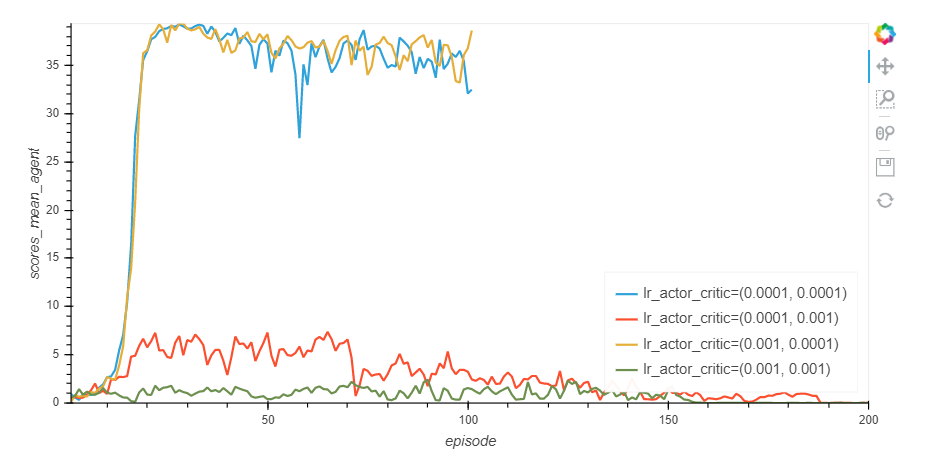
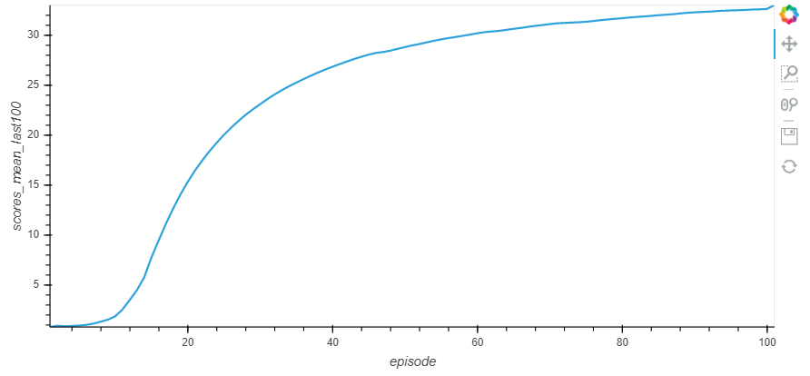

# continuous-control report  

## Description of the implementation

First of all, the implementation is based on the udacity implementation of the DDPG algorithm (see the [github](https://github.com/udacity/deep-reinforcement-learning/tree/master/ddpg-pendulum)).

This repository contains the following files :
> - train_agent.py: this file is dedicated to run a training process for an agent. It loads the environment and then run the training.
> - agent.py: this file implement the ActorCriticAgent class. It uses the DDPG algorithm (see the next part for more informations)
> - models.py: this file contains the model used for the actor network and for the critic one.
> - Training Analysis.ipynb: this notebook is usefull to test training with different parameters and compare all of them
> - train.py: this file contains the method applied to run the training. You doesn't have to call directly this file. You should use either the *train_agent.py* file or the *Training Analysis.ipynb* notebook.

The environment used in this implementation is the one with 20 agents.

## Learning Algorithm

The learning algorithm chose for this project is the DDPG one. Find more details on the [DDPG paper](https://arxiv.org/abs/1509.02971).

Here you find the main ideas of this algorithm:
- This algorithm is often classified as an actor critic algorithm. 
	- The objective of the actor part is to select the action to apply given a specified state.
	- The objective of the critic part is to estimate the expected return for a given couple (state, action)

After having taken a decision (apply action **a** from state **s**), the learning process works as follow with the environment feedbacks:
- To remind, the environment feedbacks are:
	- the new state s+1
	- the reward
	- a boolean indicating if the episode is finished or not
- The *actor* select the action **a+1** to apply in state **s+1**
- The *critic* estimate the expected return for the state **s+1** and the action **a+1**
- The *critic* compare the expected return for the state **s** and the action **a** with the **reward** + the expected return for the state **s+1** and the action **a+1**. The difference between these values is used to update the wait of the *critic* network.
- Then the weight of the actor network are updated. The actor as the particularity to directly define the policy. In order to update its weights, we compute the loss function as *minus* the expected return estimated by the *critic* for tha state *s* and the action *a* returned by the *actor*. We apply a minus given that the *actor* try to maximize the return instead of minimizing it.
- Finaly, as for the DQN algorithm, the DDQN used fixed Q-targets. It means that two networks are used for the *actor* and for the *critic*. The main objective is to stabilize the learning process. One network is trained (name local in the code) and the other one is used to defined the target (name target in the code).

As indicated before, the code is mainly based on the udacity implementation of this algorithm.

The two main changes I did are the following :
- I used a Gaussian noise instead of the *OUNoise*
- I initialized the target model weights with the local ones for the critic part and the actor one.

Regarding the network structure, I started with the udacity implementation.

### The actor networks
- The actor networks received as input the state
- Then it contains two fully connected hidden layers
- The relu activation function is used except for the output layers that used the tanh activation function (we need a value between -1 and 1 for each output value)
- The output size correspond to the action size.

### The critic networks
- The critic networks is nearly the same. There are only three differences :
	- the output size is equal to one (given that we want the expected return for a given couple (state, action))
	- The output activation function is also the relu one (given that we want a positive value)
	- The first hidden layer is concatenated with the **"action input"** and is fully connected to the second hidden layer.

Then, I mainly changed the parameters values to solve the environment.

I tested different parameterization to train the agent. However, few of them allow me to solve the environment. The most important one that help me to get good results is the learning rate for the actor and the critic. This is the most impacting parameter. Here you find a comparison on different set of learning rate parameterization.

The graph shows how the mean score of each episode evolves:

I got the best results by applying a learning rate of 1e-3 for teh actor and 1e-4 for the critic

Then I tried different sizes of hidden layers. I made the same modification for the actor and the critic networks. Here you find the results I got :

It doesn't change a lot. I kept the network with a size of 256 for the first hidden layer and 128 for the second one.

Finally, I also tried different values for the factor applied on the noise. The different values tested have not a huge impact. Here you find the results :

However, starting with a factor of 0.8 seems to be a little bit better. 

Finally, these adjustements allow me to get **an average score of 32.96 over the 100 first iterations**. Only the 101 first iteration were needed to solve the environment. 

## Plot of Rewards
This graph represents the mean score on the 100 previous episodes of the best result (the value at episode 60 is the mean score of the episodes between 1 and 60). 

## Ideas for Future Work
Several ideas could be tested for future works.
> - The DDPG algorithm was really efficient for that environment. However, it was not easy to find the good tunning to succeed. The first results were not good and we could asssume that this algorithm were not the good one. What could be nice is to implement a process to automatically tune the parameters in order to find the best set of parameter to apply.
> - It could be nice to test others algorithms to see their efficiency on continuous action space and compare the results.